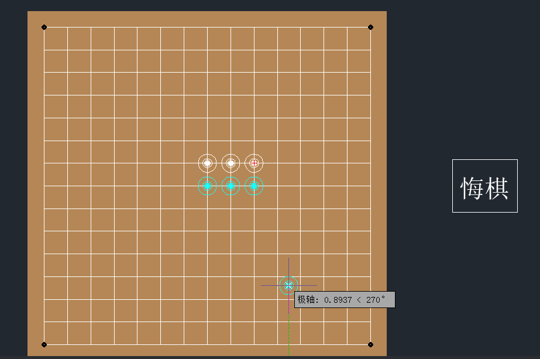
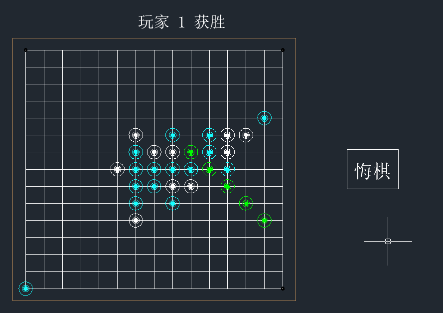

## ObjectArx 开发——五子棋

### 1. 简述

基于 ZWCAD 的 ObjectArx 开发，实现了五子棋的基本功能。使用的 IDE 是 visual studio 2017，ZWCAD 的版本是 2021 专业版。其他用到的内容有

```
    1）objectarxwizard2019.msi
    2）Autodesk_ObjectARX_2019_Win_64_and_32_Bit.sfx.exe
    3）ZWCAD_2021_ZRXSDK.exe
```

预览图：<br>



### 2. 功能和思路

导入 zrx 文件后，输入 playGame 指令创建棋盘，游戏开始。玩家点击棋盘下棋，点击悔棋按钮悔棋。当任意一方有>=5 个棋子连在一起时，该方获胜。<br>

##### 2.1. 基本思路

通过 for 循环不断读入用户的点击位置，根据点击的位置确定将进行的操作。

##### 2.2. 预绘制

创建了一个 Chess 自定义实体，并创建了它对应的 Jig。点击前可以预绘制，点击后可以根据它找到点击的位置。如果点击到棋盘外的地方则删除 jig 连接的 Chess 实体。

##### 2.3. 棋子棋盘连接

将棋子和棋盘建立反应器联系，这样棋子的位置可以适应棋盘的移动和缩放。

##### 2.4. 下棋

点击到棋盘内后，创建棋子并存入数据库。打开棋子，在棋盘格内找到离这个棋子圆心最近的一个坐标，设置棋子圆心位置到那里，同时更新棋盘记录的信息。

##### 2.5. 悔棋

设定悔棋按钮的位置，当点击到这个按钮时触发悔棋。具体实现为，在 chessBoard 内定义一个栈，每次下棋就把当前状态存入栈内，当悔棋时弹出先前状态并读取。同时，删除 react 连接和块表内的棋子对象。

##### 2.6. 胜利

根据当前下的点，在其水平竖直以及两个对角方向上遍历，如果遍历到 5 个棋子，则将这五个棋子的颜色改为绿色，并显示胜利提示。

### 3. 主函数执行顺序

主程序文件为 main.h/cpp，它引用到的函数均在 utils.h/cpp 中定义，其余代码文件为自定义实体和自定义对象。主函数为 main.h 中的 playGame(),在这个过程中先后完成了：

```
1）创建棋盘、悔棋按钮 createChessBoard()、createRegretButton()
2）开始游戏循环
3）创建棋子 createChess(double,int)
4）判断棋子位置
    bool isPointInPolygon(AcGePoint3d p, AcGePoint3d* vertices, int vertexCount)
5）安放棋子
6）校准棋子位置使其中心变为离它最近的一格棋盘
    AcGePoint3d findClosePoint(AcGePoint3d , CchessBoard* ,int&, int&);
7）将棋子添加到关于棋盘的反应器中
    void addReactor(CchessBoard* , AcDbObjectId );
8）判断是否胜利
    bool isWin(CchessBoard* , int , int , int );
9）胜利时改变棋子颜色否则继续下一轮循环
    void changeColor(CchessBoard* pChessBoard, int, int, int, int, int, int);
10）在画布上打印游戏结果
    void printToScreen(const AcString&, AcGePoint3d);

*）任意时刻点击悔棋按钮，触发悔棋
    bool regret(int& i, CchessBoard* chessBoard, int& chessColor)
*）悔棋功能中的删除反应器部分中，被注释的报错语句那里有问题，不过毕竟运行无误我就把报错注释了。

```

### 4.自定义实体/对象

自定义实体有 CchessBoard、Cchess、CchessJig、CchessBoardJig, 自定义对象为 CmyReactor。

### 5. 用到的特性

##### 5.1. React 反应器

用于监听棋盘的变形和移动，以此校准棋子位置和大小。见 myReactor

##### 5.2. Jig 和 DimData

用于棋盘的初始创建和参数显示，以及棋子放下前的预绘制。见 chessBoardJig 和 chessJig

##### 5.4. 部分 Undo

实现于 ChessBoard 类中，在 setXXX()函数中实现，与 applyPartialUndo()相配合。只是好像还没有用到过

##### 5.4. 夹点、捕捉点

夹点实现于 chessBoard 中，分别用于方便移动棋盘，捕捉点实现于 ChessBoard 中，用于棋子吸附。chess 中也有基础夹点的实现。
