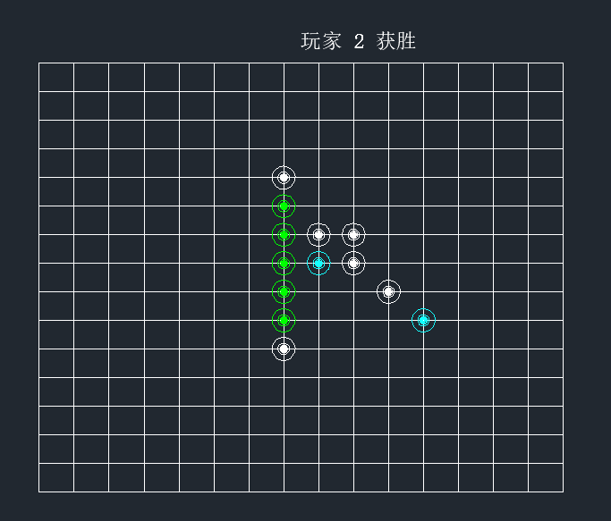

## ObjectArx 开发——五子棋

### 1. 简述

基于 ZWCAD 的 ObjectArx 开发，实现了五子棋的基本功能。使用的 IDE 是 visual studio 2017，ZWCAD 的版本是 2021 专业版。其他用到的内容有

```
    1）objectarxwizard2019.msi
    2）Autodesk_ObjectARX_2019_Win_64_and_32_Bit.sfx.exe
    3）ZWCAD_2021_ZRXSDK.exe
```

### 2. 功能和函数

导入 zrx 文件后，输入 playGame 指令创建棋盘，游戏开始。当任意一方有>=5 个棋子连在一起时，该方获胜。<br>
支持悔棋，当点击悔棋按钮时撤销上一步操作。<br>
主程序文件为 main.h，其余均为自定义实体和自定义对象。主函数为 main.h 中的 playGame(),在这个过程中先后完成了

```
1）创建棋盘 createChessBoard()
2）开始游戏循环
3）创建棋子 createChess(double,int)
4）安放棋子 createChess(double,int)内，（利用 Jig）
5）校准棋子位置使其中心变为离它最近的一格棋盘
    AcGePoint3d findClosePoint(AcGePoint3d , CchessBoard* ,int&, int&);
6）将棋子添加到关于棋盘的反应器中
    void addReactor(CchessBoard* , AcDbObjectId );
7）判断是否胜利
    bool isWin(CchessBoard* , int , int , int );
8）胜利时改变棋子颜色否则继续下一轮循环
    void changeColor(CchessBoard* pChessBoard, int, int, int, int, int, int);
9）在画布上打印游戏结果
    void printToScreen(const AcString&, AcGePoint3d);
```

预览图：<br>


### 3. 用到的特性

##### 3.1. React 反应器

用于监听棋盘的变形和移动，以此校准棋子位置和大小。见 myReactor

##### 3.2. Jig 和 DimData

用于棋盘的初始创建和参数显示，以及棋子放下前的预绘制。见 chessBoardJig 和 chessJig

##### 3.3. 部分 Undo

实现于 ChessBoard 类中，在 setXXX()函数中实现，与 applyPartialUndo()相配合。只是好像还没有用到过

##### 3.4. 夹点、捕捉点

夹点实现于 chessBoard 中，分别用于方便移动棋盘，捕捉点实现于 ChessBoard 中，用于棋子吸附。chess 中也有基础夹点的实现。
